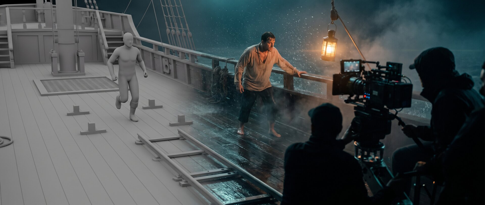

# ai-film-production



[-2563eb?style=flat-square)](https://github.com/iret77/ai-film-production/releases/latest/download/ai-film-production.skill)

A complete film-production methodology for Claude — 25 chapters of sourced, confidence-labeled craft that turn the model into your crew: DoP, editor, gaffer, script consultant, line producer. You stay the director. Built for a **Seedance 2.5 / Higgsfield Cinema Studio** stills-first pipeline, with a MiniMax H3 profile rebuilt on MiniMax's official prompt-writing guides and compact syntax profiles for Kling 3.0, Veo 3.1, and Grok Imagine.

## The problem

AI video is easy to generate and hard to direct. The default way people prompt a video model looks like this:

```
Epic cinematic shot of a hero on a wooden ship in a violent storm,
ultra realistic, 8k, dramatic lighting, masterpiece, trending
```

What comes back: a drifting face, physics from a dream, a camera that does whatever it wants, quality words the model never reads — and after five rerolls, render budget spent on slop. There is room for something better. How about:

```
SCENE CONTEXT   Ilias crosses the storm deck toward the mast while the crew
                hauls a torn sail. Night, mid-Aegean.
ACTIVE REFERENCES
                @ilias — 30s, lean deckhand, soaked linen shirt, rope-scarred
                hands. 100% matches the reference.
CAMERA          Handheld at his shoulder height, a step behind @ilias, holding his pace.
ACTION          @ilias grabs the rail, a wave bursts over the bow —
                spray hits him a beat later, he flinches, keeps moving. …
LIGHTING        Single practical: swinging deck lantern, warm tungsten, hard swings
                of shadow with the ship's roll.
POSITIVE LOCKS  Lantern stays lit in every frame. The crew stays aft of the
                mast. One continuous shot, no cuts.
```

Same model. The difference is method: every aspect has one home, every relation is visible in the frame, and the prompt is written in the logic the model was trained on — not in the logic of a human reader.

## How it works

It starts the moment you say "plan my short film." The skill doesn't jump into prompts. It reads your genre's craft baseline, asks for the story before the style, and offers a dramaturgical container. Then it builds the way productions build: locations and cast as approved reference assets first, every shot as an approved still before any video — attached as a reference anchor, not as a start frame, unless a take must chain frame-exactly onto an existing clip or interpolate between two approved stills — every prompt through a fixed seven-step checklist — canon, routing, references, writing, lint, delivery, review — and delivered under a Render Slate that names the platform, the surface, the model and mode, every input and where the result is stored. Platform facts are never invented: each slate carries a receipt that says whether the route was live-checked or taken from the skill's dated ledger. When a take comes back 90% right, it doesn't reroll; it repairs the 10% with the platform's edit modes. And everything that survives your approval becomes canon in a living production bible, so the next session picks up exactly where this one stopped.

Claude just runs a film production.

## Quick start

1. [Download the latest `ai-film-production.skill`](https://github.com/iret77/ai-film-production/releases/latest/download/ai-film-production.skill) — built automatically for every release. It's a zip with a custom suffix; macOS won't auto-extract it.
2. Upload it in Claude's skill settings (the dialog takes `.skill` directly), or unzip into your agent's skills path (e.g. `~/.claude/skills/` for Claude Code).
3. Talk to it like a director:

> "Break this logline into a treatment with a shot list: a lighthouse keeper finds a message that was never sent."
> "Make this scene AI-ready — can it even be generated?"
> "The take is perfect except the camera. Fix it without touching the performance."

The skill triggers on its own whenever the production path is clearly generative video — treatments, scripts, shot lists, asset orders, Seedance/Veo/Kling/Higgsfield prompts.

## What's inside

**25 chapters · 17 always-on rules · an economy doctrine with a division of labour between agent and model · a prompting-technique menu (Caption Spine · block structure · Master Style Block + story) chosen per project · a 7-step per-prompt checklist · a Render Slate per prompt · 10 workflow runbooks incl. the storyboard-first production model · 13 genre baselines · 31 director recipes + 11 DoP signatures · 11 animation style vocabularies + footage/era/optics packages + ~30 medium-emulation packages with motion signatures · 7 video models profiled · a platform ledger re-verified 2026-09-04 with a live MCP tool receipt of 2026-09-12.**

- **Direction & craft** — model-independent film language (composition, editing, light, color, dramaturgy), director and DoP recipes with per-recipe verify gates, genre entry points, story structures from three-act to kishōtenketsu.
- **Prompting method** — a menu of three video prompting techniques, chosen per project with the director and never one-size-fits-all: the Caption Spine (eight elements, one negation, one job per reference — no word ceiling: a prompt states what belongs in it, once), the block structure (explicit per-axis control), the Master Style Block + story (medium emulation) — all under an economy doctrine (only what is necessary or deliberately steered; nothing twice; look values as deliberate controls, never defaults; scale as relations) and a division of labour that leaves camera, cutting, body mechanics and light to the model by default; how image models actually read prompts (position, scale, count, negation — with the research receipts); style enforcement that survives more than one shot.
- **Production operations** — stills-first pipeline, the storyboard-first production model (nine gated stages: idea → bible + beat lint → storyboard with camera setup system and take/cut table → animatic [optional] → sheets → 3D blockout → location anchors → draft takes → production takes), asset and reference-pool build-out, renderability linting with green/red lists and rescue paths, coverage ladder, continuity ledger, a living production-bible convention for multi-session projects.
- **Built to be executed, not just read** — v3.0 reworked the whole skill for weaker agents: one meaning per term (`references/glossary.md`), a precedence ladder for conflicting sources, a citation convention that makes every chapter reference unambiguous, fixed order of operations, slate rows with fixed labels, receipt states that forbid fabricated platform facts, a copy-ready worked example, and six review passes with a fixed take-verdict order.
- **Platform knowledge** — Seedance 2.5 doctrine (50-reference control incl. clay-render staging — Blender-built or Seedance-generated — the edit suite, extension chains), Higgsfield Cinema Studio settings, the MiniMax H3 official schema (cut-point timestamps, six-section reference form, retention markers), compact profiles for Kling, Veo, and Grok, production rules distilled from Higgsfield's open-sourced feature films (headless sheets, one asset per state, speech-count lock, crowd scale in three layers, the negation third class), dated platform caveats, and a real-face moderation plan for licensed likenesses.

## Why you'd use it — and why you wouldn't

**Use it if** you want AI footage that doesn't look AI-generated: the whole method designs every shot around the failure classes of current video models — identity drift, physics errors, broken in-frame text, interaction errors — instead of fighting them in post. And if you burn money on rerolls: the checklist, the lint passes, and the repair-before-reroll rule exist because every skipped step has already cost real render budget.

**Skip it if** you want a one-click text-to-video toy — this is a methodology that expects a director's decisions, and it will ask for them. Skip it if your pipeline is built on a stack it doesn't cover deeply (it's Seedance/Higgsfield-first; MiniMax H3 gets a full official-schema profile, Kling, Veo, and Grok compact profiles, everything else principles only). And know that model facts age in weeks: version-volatile claims are marked as such and should be re-verified against the live platforms before a production run.

## Where the rules come from

No rule ships without a label: 🟢 verified across sources / official / production-proven · 🟡 plausible but single-source or untested · 🔴 marketing claim — test yourself. Source tags ([H-off], [BD-off], [MM-off], [F], [P17–P69] — itemized in `references/sources.md`; P1–P16 unitemized —, [PP], [W], …) trace every rule to its origin — official platform docs and prompt-writing guides, the vendor's own open-sourced feature-film breakdowns, practitioner protocols, deep-research passes over papers and benchmarks, and first-party production sessions whose lessons flow back here as generalized rules. Where sources conflict, the conflict is documented with ⚠️ instead of silently resolved.

## Philosophy

- **Stills-first** — the look is won in the image; video only secures it.
- **Canon before invention** — every beat is read from the script, never guessed into a prompt.
- **References over prose** — prose is for what happens; references are for what persists.
- **Repair before reroll** — an approved take is edited, never re-diced.
- **Ellipsis over simulation** — what the model can't render, the edit implies.

## Structure

<details>
<summary>All 20 files at a glance</summary>

| File | Role |
|---|---|
| `SKILL.md` | Entry point, compressed to the binding core: language rule and role, the economy doctrine with the division of labour, the receipt line, a loading map (what to open for which job — nothing for the always-rules), citation convention, precedence ladder, compact task routing (order of operations + spine table), 17 inline always-rules, each one imperative with at most three duty bullets (incl. rule 4: the prompting-technique menu; rule 7: scale and distance as relations, look values as deliberate controls), the mandatory per-prompt checklist with the seven-measure video-prompt lint, Render Slate contract with `Lint` row and ID grammar, 5-step project workflow; no reference-file index — the routing table and the loading map replace it |
| `references/genre-baselines.md` | 13 genre entry points (incl. Commercial/Ad): craft defaults, subgenres, recipe shortlists, per-genre skill filters |
| `references/production-pipeline.md` | Ch. 1–11 + 16: pipeline principles, assets, QA, model choice, coverage ladder, interview production path (7b) |
| `references/video-prompting.md` | Technique menu + ch. 12h + 12 + 14 + 14b: the Caption Spine (technique A, with lint and copy-ready skeleton), the block structure (technique B), cross-model adaptation, sequence prompting, negation classes, Seedance 2.5 doctrine (reference-maximal control, edit suite, extension chains, large casts, montage ceiling, Dreamina-only surfaces) |
| `references/platforms-models.md` | Ch. 13 + 21: archival Higgsfield Cinema Studio notes; MiniMax H3 profile on the official guides (three-field base form, six-section Ref2VA, camera vocabulary, dialogue tags); Kling/Veo/Grok compact profiles |
| `references/platform-ui-workflows.md` | Current, source-linked UI/workflow reference and version ledger: which web/MCP/ChatGPT surface owns each selectable setting in Higgsfield, fal.ai, Runway, OpenArt, Arcads, and GPT Image 2.5; plus re-verification rules |
| `references/post-audio-legal.md` | Ch. 17–20: post, audio/music/voices, continuity, legal & AI disclosure |
| `references/style-control.md` | Style enforcement across image and video models, vocabularies, reference protocol |
| `references/image-model-logic.md` | Ch. 24: how generators read prompts — writing contract, position/scale/count/negation recipes, mask strictness per platform |
| `references/renderability.md` | Green/red lists, rescue paths, format matrix, model quick profiles |
| `references/film-craft.md` | Model-independent film language: composition, camera, editing, light, color, timing, dramaturgy |
| `references/director-recipes.md` | 31 director recipes + 11 DoP signatures; selection index, per-recipe Verify gates, harmony map |
| `references/pixar-look.md` | Sourced Pixar look bible incl. figure-anchor rule, style-forcing method, and the hybrid previs-to-AI case study (wide-shot rescue, hidden faces, style donor) |
| `references/production-bible.md` | Ch. 22: living project-state document — template (incl. storyboard canon section B3b and take/cut columns on the shot board), session rules, platform mapping, ID grammar (Render ID tokens, instance chain, bootstrap) |
| `references/story-structures.md` | Ch. 23: dramaturgical containers — intake gate, classic/alternative structures, series poles & online-native formats |
| `references/workflows.md` | Ch. 25: ten runbooks for the typical production jobs — project start to session close, with interaction contract, lock gate and receipt states; W10 = the storyboard-first production model in nine gated stages (stage 4, the animatic, optional) |
| `references/worked-example.md` | Compact end-to-end mini production: shot table, asset order, the same take as a Caption Spine delivery and as a block-structure delivery, risk register, extension round, bible rows |
| `references/glossary.md` | One meaning per term: shot/take/sequence, plates and sheets, the seven kinds of anchor, locks, channel/axis, camera setup / panel / take-cut table / state ladder, artefact names |
| `references/agent-models.md` | Which agent model runs this skill well: first-party cold-test results per model (Claude Fable 5.1, GPT-5.6 Sol and Terra), delegation rules for subagents and batch runs, the cold-test protocol |
| `references/sources.md` | Canonical tag legend; registry of practitioner and vendor-thread protocols P17–P69 plus [MM-off] (date, URL, sponsorship flag); dated evidence notes — ledger re-verification, OpenAI image-model refresh, first-party [PP] production sessions |
| `LICENSE` | MIT |

</details>

## Versioning

v3.4 (2026-09). Universal — contains nothing project- or person-specific. From this version on the version string carries no language suffix: English is the only edition. This repository is the source of truth for the skill; lessons from production flow back here via commits, and every release ships an upload-ready `.skill` package.

### Changelog

- **v3.4 (2026-09-19)** — Four batches released together: the prompt budget with the lint that enforces it, the economy doctrine with a menu of prompting techniques, drawn from a first-party production session, the P51–P69 practitioner batch with medium-emulation styles, motion grammar and the performance-capture path, and a vendor-alignment batch that lays every contested rule against the vendors' own documentation; SKILL.md compressed to its binding core (5,833 words: one imperative plus at most three duty bullets per rule, bookkeeping in the reference file that owns it; cold tests on three agent models before and after, none worse).
  - Batch 3 — vendor alignment (2026-09-18): every contested rule was traced to its source and laid against the vendor's own documentation, read in the original (ByteDance 2.5 prompt guide, 2.5 tutorial, 2.0 series guide, the official `sd25-pe` prompt skill, Seed launch blog; Google Veo best practices; Kling VIDEO 3.0 and Omni guides; xAI and OpenAI docs; Higgsfield's Seedance 2.5 guide and API docs). New: **source tiers** in the precedence ladder and the sources legend (vendor documentation and first-party measurement · platform tutorials and established practitioners · single social finds, which never win a frontal contradiction with a vendor statement without striking proof) and the **version rule** (know-how for an older model version holds on the newer one until version-specific information says otherwise) with the documented Seedance 2.0 → 2.5 differences as a table — 2.0 does not respond to timestamps, so timecode beats are a 2.5 form and 2.0 takes numbered shots · **no word ceiling for video prompts**: the first-party rejects were prompt faults, not render faults; ch. 12h now states what belongs in a prompt, what does not and when it is complete (eight checks: no contradiction, scenic not technical, relations not measures, acting directions, one timeline, one geography, literal wording, working lines carried forward) and the lint counts words without limiting them · **audio notation corrected**: the vendor's symbols (`( )` music, `< >` sound effect, `{ }` dialogue, `【 】` subtitle) or plain prose with quoted lines, one form per prompt, the music exclusion as a plain sentence — the skill's earlier mapping had no source and had put the music exclusion into the subtitle bracket · **timing**: three vendor forms (ranges, time points, relative time), stamps admissible inside one continuous take as event budgets, overfilled windows named as the cause of unrequested cuts · speed ramp and bullet time inside a take · ranges for multi-view subjects and groups · reference scoping whole vs. part · negations vendor-backed for subtitles and audio, an unverifiable ByteDance quote removed · Veo dialogue with a colon and without quotation marks · Kling profile split into VIDEO 3.0 (interface binding) and 3.0 Omni (`@Name` in the text); camera-first on Kling and a leading style qualifier on Grok downgraded to practitioner recommendations · subtitle-leak and extension-seam remedies, edit trigger words and A-to-B wording · the draft batch runs at the take's planned length · **new camera angles from a filmed clip** (coverage ladder, edit route vs. reference route) · **Higgsfield API** as a new access route (`HF-API@2026-09-18`: endpoints per Seedance mode, 480p/720p only for 2.5, own dollar balance, references as URL arrays) · new `agent-models.md`.
  - Batch 2 — economy doctrine, division of labour, technique menu, rule 7, video-prompt lint (2026-09-14): From a first-party production session (stylized-3D short, ~30 takes over four weeks, Seedance 2.5 in Higgsfield Cinema Studio, 720p, 10 s, t2v with 0–2 references): skill-conformant block prompts of 1,100–1,300 words that locked every axis, quantified every value and appended an exclusion list to every reference — written out of distrust of the model — ran at roughly 80 % rejects with structural faults in every iteration round, while a ~250-word caption on the same take reproduced its beat structure in four of four control runs with polish-only variance, every reference doing its one job without a `Do not copy` line, and one camera line restoring the axis across an internal cut. New: the **economy doctrine** (SKILL.md, directly after Role — a video prompt states only what is explicitly necessary or deliberately steered; nothing twice, no contradictions, nothing out of distrust) with the **division of labour** as default allocation for every video model (the model owns camera composition, in-take cutting, body mechanics, material, light and transitions unless the agent steers one deliberately; the agent always owns scene content, beat order and end states, one job per reference, canon, at most one camera line) · **rule 4 becomes the prompting-technique menu** — A Caption Spine (new ch. 12h: title sentence · STYLE line · character line(s) · optional location-style line · optional single camera line · timecode beats · "End with …" · one closing sentence), B block structure (ch. 12, explicit per-axis control, a lock lives once), C Master Style Block + story (style-control §6c) — never one-size-fits-all: the technique is decided WITH the director at intake together with project type, look and video model, tested with 2–3 draft takes when unclear, and persisted with the frame decisions (bible section B1) for every later session; a technique-menu preface in `video-prompting.md` carries fit, price and the selection protocol · a **seven-measure lint on every video prompt** (word count without a ceiling · negations · numerals that are not deliberate look controls · absolute measures · double mentions · contradictions · complete beats) written into a new Render Slate `Lint` row; a prompt that fails a measure is repaired, never delivered with a reason · new **always-rule 7: scale and distance are relational, look values are deliberate** — no metres, body-lengths-as-unit or unit counts in any video or still prompt (one visible relation between two frame objects per axis; a lead's scale that failed for weeks under numbers landed on one relational half-sentence in the first run), while lens, aperture, FOV and Kelvin remain permitted look controls, never defaults, each written only when a specific look needs it and listed in `Crew choices` (12c/12d reframed accordingly; 24b/24d, the still-prompt lint — now eight checks — sheet orders with a comparison object, the shot-table `Framing` column without degrees) · **rule 15 repair order** — first suspect is over-instruction: remove lines first, change one second, add only third; iterations 1–3 never raise the word count · the `Crew choices` slate row now lists the axes deliberately left to the model · `worked-example.md`: §3b the take as a Caption Spine (the technique that example project chose), §3 the same take in the block structure for comparison, the extension round in the spine · Kling/Veo/H3 profiles, style-control §1/§5/§7, glossary (prompting technique, economy doctrine, division of labour, relation vs. measure) updated; sources.md [PP] entry 2026-09-14 · SKILL.md compressed to the binding core with a loading map (~6.5k words, from 10k); reference files got contents blocks; release audit (consistency, options with guidance, English, no personal data, examples) · independent pre-release review (2026-09-18): lint fixed terms and the closing-image clause defined, technique-C example beats reduced to events, W2 and W10 synced with production-pipeline ch. 6/16, rule-15 counting aligned in the worked example, contents blocks for workflows, worked-example, story-structures and production-bible; rule 4 states how the technique question is put (all three entries, recommendation with reason, draft-batch offer); rules 4 and 6 reconciled on style bans (conditional: repetition and ratio decide, ch. 14); new `agent-models.md` with measured per-model results and the cold-test protocol.
  - Batch 1 — practitioner batch P51–P69 (2026-09-12): Nineteen new sources (P51–P69: Atomic Gains' 33-style Seedance 2.5 library with its public prompt document, twelve Dan Kieft tutorials, AI Shot Studio's 42-move camera list, Joey / CTRL's skills-release walkthrough, and four Higgsfield official tutorials [H-off] — the agent-driven Blender/3D Jutsu build, the one-chat talking-head tutorial, Marketing Studio motion design via MCP, and the six-era love story, Jan–Sep 2026) read as full transcripts plus their public prompt documents and sites; P17 identified and itemized. New: the **Master Style Block** as the delivery shape for medium-emulation looks (style-control §6c — a seven-layer medium description that opens the prompt; technique C of the rule-4 menu in this release, adopted after a first-party review of the P51 demos [PP]), the **medium motion grammar** rule (style-control §5b — a physical-medium or era-animation look holds in video only when the prompt names how the medium moves and refuses interpolated smoothness once), **§6c medium-emulation packages** (~30 rows: cel eras, sumi-e, silk, paint-on-glass, painterly 3D, charcoal, marker, theatrical slapstick, action figures, marionettes, comedic noir, live-action + cartoon hybrids, smear, creature VFX, felt, paper cut-out, parchment, tapestry, papier-mâché, marbled paper, screen print, tokusatsu, sitcom cartoon, editorial, CRT — tokens, motion signature, trap), the **performance-capture path** (production-pipeline ch. 9: act it on a phone, re-skin via Seedance 2.5 Edit — seven rules), the **four-field camera phrase** (Movement / Speed / Framing / End) for the CAMERA block, the **G-panel sheet with a blank layout template**, copy-ready **seamless-transition and extension wording**, `@Audio` as **diegetic playback**, the **exact-lines lock**, **Rule 5 of reference integration** (a restyle transforms construction, never adds a surface), the **face-first / outfits-as-a-step** sheet workflow with the 18%-grey rationale, **speech-to-speech unification** of generated dialogue and the **a-cappella-stem lip-sync** variant, and from the vendor batch: the **physics/acting split** (two takes, never one), the **hybrid face sheet** for real people, **plate selection by the action's geography** and populated crowd plates, the **height sketch** and per-shot sketches as spatial-logic channels, five **blockout protocols** (seamless loop, mirror pass-through, multi-location continuous take, formation crowds, scale + transition in one take) with 3D Jutsu described, the **presenter-from-own-clip path** (ch. 7b) and the vendor form of the MCP connection test, in-frame-text **exception (c)** for Marketing Studio motion design, background life upgraded to 🟢; a **Flux 3 Video** quick profile, a live-read **HF-MCP@2026-09-12** tool receipt, and dated UI sightings (green tag binding, sequel/prequel extend labels, Reframe, Multi shots, Cinematic Locations, Ad multiplier, OpenArt credit orders of magnitude). Documented conflicts, unresolved by design: millimetre lenses in video prompts (⚠️ vs FOV°), single-view images per subject instead of a sheet on 2.5 (⚠️ vs the feature-film sheet). Limitation: the video frames were not viewed — transcript and public prompt documents only; on-screen-only prompt text stays 🟡.
  - Batch 0 — prompt budget, refinement ratchet, still-prompt lint (2026-09-11): **Prompt budget, and the lint that enforces it.** From a first-party production session on a figure-less dark exterior anchor (`gpt-image-2` generation, eight consecutive runs) — findings measured, not inferred: the **word budget is a hard rule scoped to the model AND version** (a 1259-word prompt carried two instructions in full and ignored both; the same content at ~300 words landed both), over-budget instructions fail silently and get misread as model limits, and the way agents get there is the newly named **refinement ratchet** — a text LLM refines after every failure, so the prompt grows monotonically; counter-rule: after a failed run you REPLACE, never append. New **ch. 24i still-prompt lint** (seven checks before any still prompt ships) wired into SKILL rule 6 and the per-prompt checklist. New rules: the **counterweight sentence** (name a class's default state before its exceptions, or the exceptions become the class — 24a), the **Avoid-list budget** with a protected world-rule subset that trimming may never touch (24f), **quantifier → mass noun that carries the disorder itself** (24e), **one-sentence reference roles** and the **literal `@token`** address rule (style-control §7 Rules 0b/1b), and the receipt that a prompt-stated aspect ratio does not set the canvas. Fixed a **scoping bug in pixar-look §9**: the faceted-silhouette refinement now carries its scope bracket, so it cannot be read as a global material instruction. No structural change — 16 always-rules, same file set.
- **v3.3-en (2026-09-10)** — **Animatic / timing-simulation stage** added to the W10 storyboard-first model as the new (optional) stage 4, between storyboard and sheets: play the look-free panels as a timed reel — each held for its take-table `Len`, with scratch audio — to test montage, order, rhythm, causality and per-shot duration before any consistency asset or paid render is built. Three per-beat fidelity rungs: **R1** held stills, **R2** deterministic camera on the still (Ken Burns / two-panel interpolation), **R3** sub-shot panels for fast/complex action (hand- or AI-drawn in-betweens, cheap image-gen, or a 480p tween), with a binding R3 discipline (the in-betweens carry action progression and timing only, never performance/optics/identity). Deliverable is a revised take/cut table (`Len` locked, internal-shot counts decided, continuity/causality flags); W10 renumbered to nine gated stages; new glossary term **Animatic**; SKILL routing + reference index synced; FilmFlow Pro reused as the R1/R2 tool. No change to any other rule or structure.
- **v3.2-en (2026-09-09)** — **GPT Image 2.5** replaces GPT Image 2 as the OpenAI still model: API `gpt-image-2.5-flare` (default, fast) + `gpt-image-2.5-sunburst` (edit-precision), refreshed ledger keys + API specs (sizes to 3840 px/edge; quality/background/format enums), and the ChatGPT-native Images 2.5 surface (Sketch/Templates/on-image comments). Improvement claims (edit locality — image-model-logic 24g; identity/style hold; ~50% speed) are tagged 🔴 pending a production A/B; the `[PP]`/`[P]` findings from the gpt-image-2 generation are preserved with provenance notes. Routing + token grammar → 2.5; no rule or structure changes.
- **v3.1.1-en (2026-09-07)** — version line directly under the SKILL.md title; no rule changes.
- **v3.1-en (2026-09-07)** — W10 storyboard-first production model (eight gated stages with deliverable, gate and reads; camera setup system, take/cut table, state ladder, layout map; blockout trigger rule; draft-tier test takes; production-take edit route as a documented exception); STORYBOARD deliverable shape + export schema (production-pipeline ch. 2); bible section B3b + shot-board columns Internal TC / Cut type / Continuity lock / State; glossary terms; FilmFlow Pro planning ledger key `FILMFLOW-WEB@2026-09-07`; the rules W10 relies on were unified into their canonical chapters (build-order rule with three cases in ch. 1, anchor standard ch. 3, light openings and scale relations ch. 4, position lock ch. 6, blockout trigger rule ch. 8, two storyboard roles ch. 9, production-take exception W3 step 6, four new renderability §2 rows) and W10 only cites them.
- **v3.0-en (2026-09-05)** — executability rework for weaker models (89 review findings), platform ledger re-verified 2026-09-04, glossary and ID grammar as reference files, trigger eval 19/20.

## License

[MIT](LICENSE).
